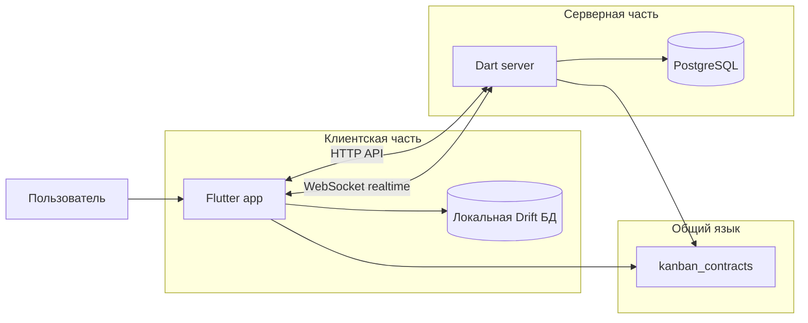
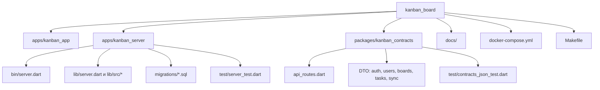
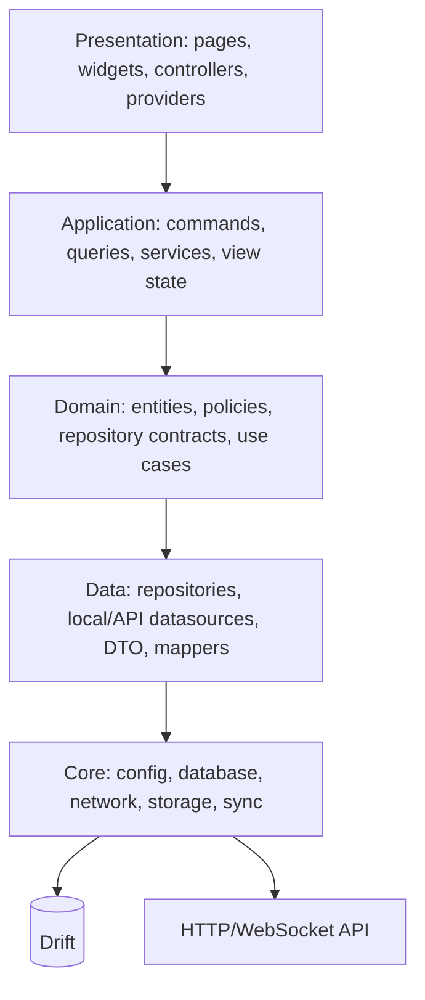
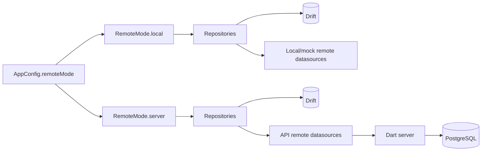
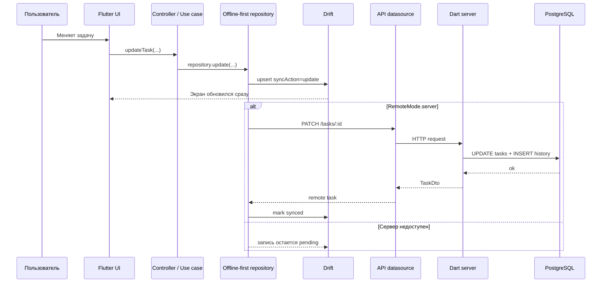
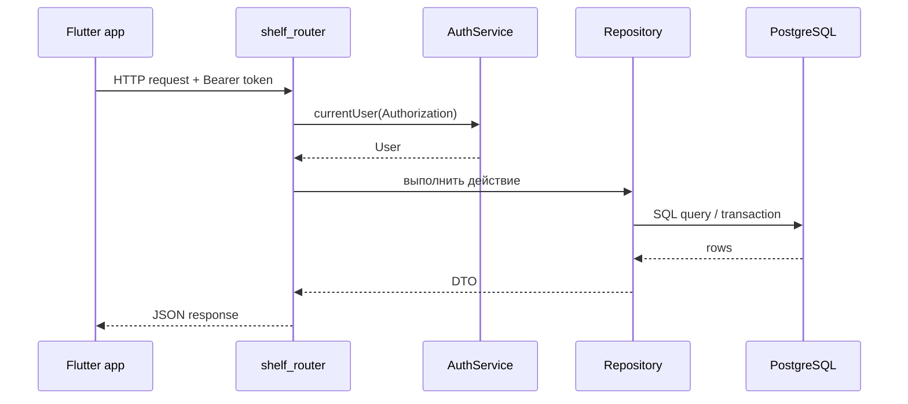
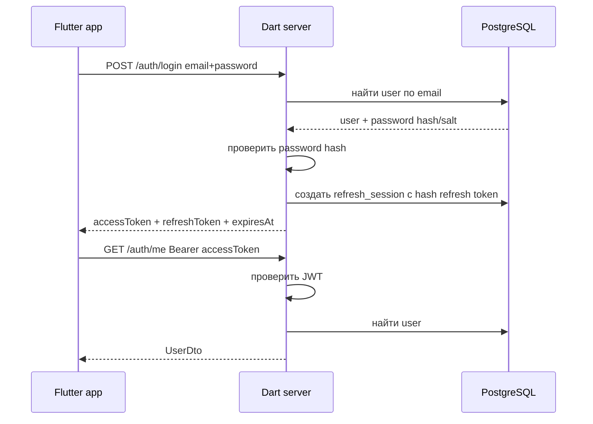
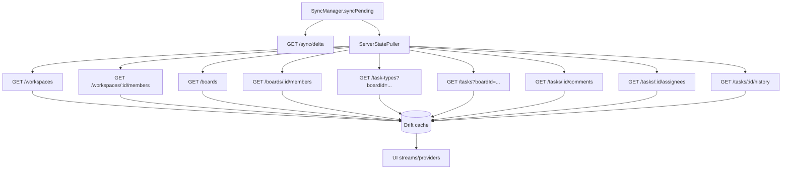
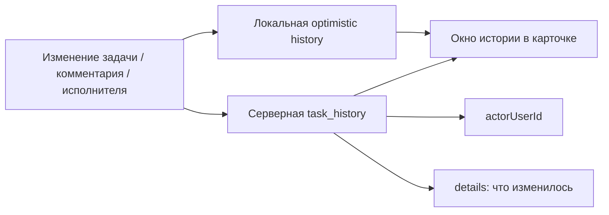
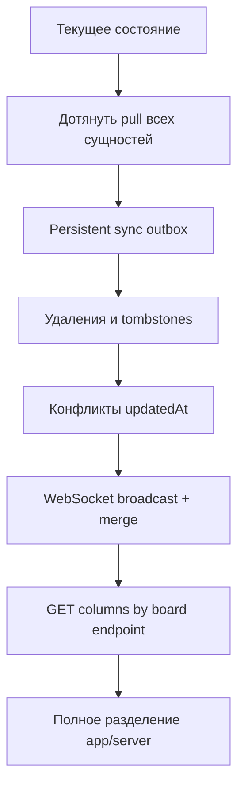

<!-- Набор схем проекта: как связаны Flutter app, сервер, shared contracts, Drift, PostgreSQL и синхронизация. -->

# Схемы Работы Проекта

Эти схемы показывают проект крупными кусками: что где лежит, как идут данные и
что происходит при изменении задачи.

## Общая Картина

Смысл простой:

- Flutter app показывает интерфейс и всегда читает быстро из Drift.
- Dart server хранит общие данные для всех пользователей.
- `kanban_contracts` фиксирует общие DTO и routes, чтобы app и server говорили
  на одном JSON-языке.

## Как Разделен Репозиторий

## Слои Flutter App

Правило: UI не должен напрямую знать про Drift, Dio или PostgreSQL. UI вызывает
controllers/use cases, а repositories решают, писать локально или ходить на
сервер.

## Local И Server Режимы

`local` удобен для разработки интерфейса. `server` нужен, чтобы приложение
работало через backend и синхронизацию.

## Что Происходит При Изменении Задачи

Главная идея offline-first: пользователь видит изменение сразу, а серверная
синхронизация догоняет состояние после этого.

## Как Сервер Обрабатывает Запрос

На сервере repositories работают с PostgreSQL напрямую. DTO ответа берутся из
`kanban_contracts`.

## Авторизация

Пароль в чистом виде не хранится. Refresh token в базе хранится как hash.

## Входящая Синхронизация С Сервера

Сейчас pull подтягивает workspaces, workspace members, boards, board members,
task types, tasks, comments, assignees и history. Columns и invitations ждут
готовых server endpoints для полного pull.

## История Задачи

Цель: серверная история должна стать источником истины, а локальная история
остается быстрым optimistic-кешем.

## Что Еще Нужно Доделать Для Полного Разделения

Flutter app физически живет в `apps/kanban_app`. Корень репозитория остается
слоем orchestration: команды, Docker Compose и документация.
